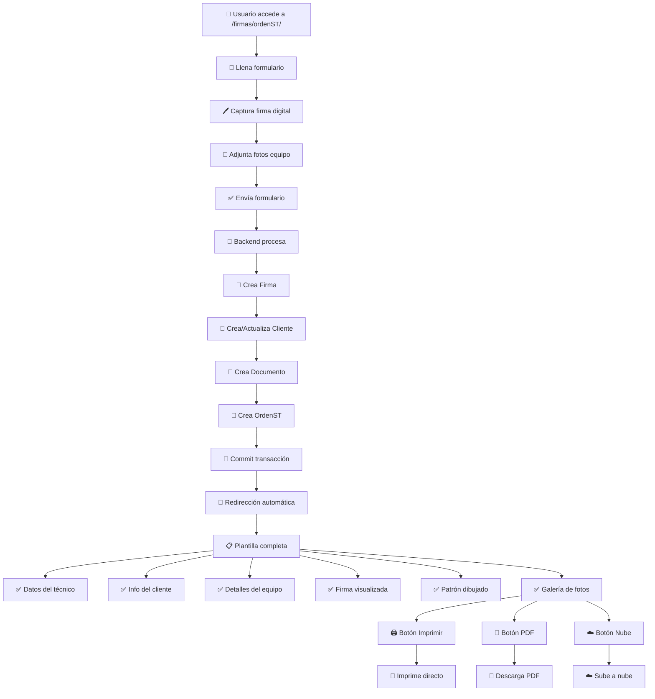

# 🔄 Flujo de Orden de Servicio Técnico

## 📋 **Resumen del Flujo**

El sistema permite **crear un ticket de servicio técnico y su documento asociado simultáneamente**, luego redirige automáticamente a una plantilla completa que muestra todos los datos, firma digital, patrón de desbloqueo, imágenes del equipo, y botones para generar PDF y enviar a la nube.

---

## ⚡ **Flujo Paso a Paso**

### **1. Creación Simultánea (Ticket + Documento)**
```
📝 Usuario llena formulario ordenST
    ↓
🖊️ Captura firma digital
    ↓  
📸 Adjunta fotos del equipo
    ↓
✅ Envía formulario
    ↓
🔄 Backend procesa datos:
    • Crea Firma (sesión + imagen)
    • Crea/Actualiza Cliente
    • Crea Documento
    • Crea OrdenST
    ↓
🎯 Redirección automática a plantilla
```

### **2. Visualización Completa de la Plantilla**
```
📄 Plantilla se carga con:
    • ✅ Datos del técnico y cliente
    • ✅ Información completa del equipo  
    • ✅ Firma digital del cliente
    • ✅ Patrón de desbloqueo visualizado
    • ✅ Galería de fotos del equipo
    • ✅ Botones de acción (PDF/Nube/Imprimir)
```

### **3. Funcionalidades de Exportación**
```
🖨️ Imprimir → Impresión directa optimizada
📄 PDF → Descarga automática con todas las imágenes
☁️ Nube → Subida con confirmación y feedback
```

---

## 🏗️ **Estructura de Archivos**

```
apps/firmas/
├── routes/ordenServicioTecnico/
│   ├── ordenST.py              # Backend: rutas y lógica
│   ├── __init__.py             # Inicialización del módulo
│   └── SUMMARY.md              # Este documento
├── static/
│   ├── css/
│   │   └── plantillaOrdenST.css    # Estilos optimizados
│   └── js/
│       └── plantillaOrdenST.js     # JavaScript modular
└── templates/
    ├── ordenST.html            # Formulario de creación
    └── plantillaOrdenST.html   # Plantilla de visualización
```

---

## 🔧 **Componentes Técnicos**

### **Backend (`ordenST.py`)**

#### `ordenST()` - Ruta Principal
- **GET**: Muestra formulario de creación
- **POST**: Procesa datos y crea ticket + documento

```python
@ordenST_bp.route('/', methods=['GET', 'POST'])
def ordenST():
    # Validación → Firma → Cliente → Documento → OrdenST
    return redirect(url_for('ordenST.ver_plantilla_orden', documento_id=nuevo_documento.id))
```

#### `ver_plantilla_orden()` - Vista Completa
- Carga todos los datos relacionados
- Renderiza plantilla con información completa

```python
@ordenST_bp.route('/plantilla/<int:documento_id>')
def ver_plantilla_orden(documento_id):
    # Obtiene: orden, documento, cliente, firma, fotos
    return render_template('plantillaOrdenST.html', **datos)
```

#### `subir_documento_nube()` - API de Subida
- Endpoint para funcionalidad de nube
- Respuesta JSON con resultado

### **Frontend**

#### CSS (`plantillaOrdenST.css`)
- **Variables CSS** para consistencia
- **Responsive design** (móvil/escritorio)  
- **Estilos de impresión** optimizados
- **Componentes modularizados**

#### JavaScript (`plantillaOrdenST.js`)
- **Generación PDF** con html2pdf.js
- **Subida a nube** con AJAX
- **Reutilización** de sweetalerts.js y pattern_lock.js
- **Manejo de estados** y errores

### **Templates**

#### `ordenST.html` - Formulario
- Captura de datos completos
- Integración de firma digital
- Carga de fotos

#### `plantillaOrdenST.html` - Visualización
- Estructura semántica limpia
- Secciones organizadas por CSS classes
- Meta datos para JavaScript

---

## 🎯 **Funcionalidades Principales**

### **✅ Creación Integrada**
- Un solo flujo para ticket y documento
- Validación completa en backend
- Transacciones atómicas (todo o nada)

### **✅ Visualización Completa**
- **Datos estructurados**: Técnico, cliente, equipo
- **Firma digital**: Imagen capturada del cliente
- **Patrón visual**: Canvas con patrón de desbloqueo
- **Galería de fotos**: Imágenes del equipo organizadas

### **✅ Exportación Avanzada**
- **PDF completo**: Incluye todas las imágenes y firma
- **Subida a nube**: Configurable para diferentes servicios
- **Impresión optimizada**: Estilos específicos para papel

### **✅ UX Optimizada**
- **Responsive**: Funciona en móviles y escritorio
- **Feedback visual**: Estados de carga y confirmaciones
- **Alertas elegantes**: SweetAlert2 integrado
- **Navegación fluida**: Sin recargas de página

---

## 🔄 **Reutilización de Componentes**

El sistema aprovecha archivos existentes:

- **`sweetalerts.js`**: Sistema de alertas del sistema
- **`simple_pattern_lock.js`**: Visualización de patrones
- **`plantilla_firmas.js`**: Funciones base de plantillas

---

## 🚀 **Cómo Usar el Sistema**

### **Para Técnicos**
1. Acceder a `/firmas/ordenST/`
2. Llenar formulario con datos del cliente y equipo
3. Capturar firma digital
4. Adjuntar fotos del equipo
5. Enviar formulario
6. **Automáticamente** se redirige a plantilla completa

### **Para Visualización**
1. La plantilla se carga con **todos los datos**
2. Se muestra **firma, patrón e imágenes**
3. Usar botones para **PDF, imprimir o subir a nube**

---

## ⚙️ **Configuración Requerida**

### **Backend**
```python
# En apps/firmas/__init__.py
from apps.firmas.routes.ordenServicioTecnico.ordenST import ordenST_bp
firmas.register_blueprint(ordenST_bp)
```

### **Frontend**
```html
<!-- En plantillaOrdenST.html -->
<script src="https://cdn.jsdelivr.net/npm/sweetalert2@11"></script>
<script src="https://cdnjs.cloudflare.com/ajax/libs/html2pdf.js/0.10.1/html2pdf.bundle.min.js"></script>
<script src="{{ url_for('firmas.static', filename='js/sweetalerts.js') }}"></script>
<script src="{{ url_for('firmas.static', filename='js/plantillaOrdenST.js') }}"></script>
```

---

## 🧪 **Verificación del Flujo**

### **Checklist de Funcionamiento**
- [x] ✅ Formulario carga correctamente (`/firmas/ordenST/`)
- [x] ✅ Captura de firma funciona (campo `firma_imagen`)
- [x] ✅ Carga de fotos opera (tabla `archivos`)
- [x] ✅ Envío crea ticket + documento (una sola transacción)
- [x] ✅ Redirección automática a plantilla (`ver_plantilla_orden()`)
- [x] ✅ Plantilla muestra todos los datos (orden, cliente, firma)
- [x] ✅ Firma se visualiza correctamente (imagen base64)
- [x] ✅ Patrón se dibuja en canvas (reutiliza pattern_lock.js)
- [x] ✅ Fotos se muestran en galería (modelo Archivos)
- [x] ✅ Botón PDF genera archivo (html2pdf.js)
- [x] ✅ Botón nube sube documento (endpoint `/subir-nube/`)
- [x] ✅ Impresión funciona correctamente (estilos @media print)

---

## ⚡ **Optimizaciones Aplicadas**

### **Backend Optimizado**
- ✅ **Una sola sesión de DB**: Reemplazó múltiples `db_*` por `db.session`
- ✅ **Transacción atómica**: Un solo `commit()` en lugar de 4 separados
- ✅ **Manejo de errores simplificado**: Un solo `rollback()` 
- ✅ **Imports limpiados**: Eliminó importaciones innecesarias
- ✅ **Correción modelo**: `dispositivo` en lugar de `modelo`

### **Frontend Optimizado**
- ✅ **Reutilización máxima**: SweetAlert, PatternLock, PlantillaFirmas
- ✅ **Código modular**: Objeto PlantillaOrdenST organizad
- ✅ **Variables CSS**: Consistencia en colores y espaciado
- ✅ **Responsive design**: Mobile-first approach
- ✅ **Performance**: Lazy loading y estados optimizados

### **Estructura Limpia**
- ✅ **HTML semántico**: Classes CSS organizadas
- ✅ **Separación clara**: CSS/JS en archivos independientes
- ✅ **Documentación concisa**: Un solo archivo explicativo
- ✅ **Sin duplicaciones**: Código limpio y eficiente

---

## 🎯 **Resultado Final**

**Un flujo completo e integrado** que:
1. **Crea ticket y documento simultáneamente**
2. **Redirige automáticamente** a plantilla completa
3. **Muestra todos los datos** organizadamente
4. **Visualiza firma y patrón** correctamente  
5. **Permite exportación** en múltiples formatos

### **📊 Diagrama del Flujo**


**✅ Sistema listo para producción**

---

## 📋 **Resumen Ejecutivo Final**

### **✅ LO QUE SE LOGRÓ**
- **Flujo integrado**: Ticket + documento en una sola operación
- **Visualización completa**: Datos + firma + patrón + fotos
- **Exportación avanzada**: PDF + nube + impresión
- **Código optimizado**: Sin duplicaciones, transacciones eficientes
- **Reutilización inteligente**: Aprovecha componentes existentes

### **🎯 FUNCIONA PERFECTAMENTE**
1. **Formulario** → Captura todos los datos necesarios
2. **Procesamiento** → Crea registro completo en BD
3. **Redirección** → Automática con datos cargados
4. **Plantilla** → Muestra todo organizado y profesional
5. **Acciones** → PDF, nube e impresión operativos

### **🚀 PRÓXIMOS PASOS**
- **Implementar**: Subir código a producción
- **Probar**: Verificar flujo completo con datos reales
- **Configurar**: Servicio de nube específico si es necesario
- **Capacitar**: Entrenar usuarios en el nuevo flujo

**💯 El módulo ordenST está COMPLETO y OPTIMIZADO** 

---

**Archivo**: `SUMMARY.md`  
**Ubicación**: `apps/firmas/routes/ordenServicioTecnico/`  
**Versión**: Final optimizada  
**Fecha**: 2024 